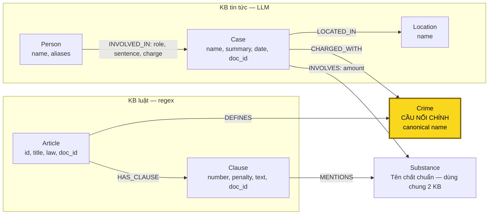

# Thiết kế Ontology — Day 19

**Họ tên:** Trần Quốc Vương  **MSSV:** 2A202602522

**Lựa chọn** (đánh dấu một):
- [x] Dùng ontology gợi ý (có thể chỉnh nhỏ)
- [ ] Tự thiết kế (xét bonus +15, xem `SUBMISSION.md`)

**Trạng thái:** KG-1 đến KG-4 đã được triển khai theo bảy label HINT, bổ sung chuẩn hóa khóa và giữ provenance. 48 test gốc và 35 test bổ sung đều pass. Đã kiểm chứng multi-hop trên Neo4j qua driver bằng fixture tổng hợp rồi rollback; không lưu fixture làm dữ liệu bài nộp. Chưa nạp tin tức bằng LLM thật vì `.env` chưa có API key; chưa có kết quả build đầy đủ/benchmark hoặc đủ 7 `[OK]` của runner. Không nhận bonus cho những chỉnh sửa nhỏ này.

### Dữ liệu đã đọc và những thành phần chung

Đã đọc Điều 251 BLHS, sáu câu trong `data/benchmark_kg.json` và bốn bài chính:

| Tài liệu tin tức | Quan sát dùng cho thiết kế |
| --- | --- |
| `news-100260918080821054` — vụ Lê Minh Thành | Mức án thuộc từng người: Thành 36 tháng, ba người khác 24 tháng; có cả thông tin sơ thẩm và kháng cáo. MDMA được nêu qua kết luận giám định. |
| `news-100260928173914514` — đường dây hơn 36 kg ma túy | Trong cùng vụ có người bị tuyên tử hình và người nhận hình phạt khác; có cả tội mua bán và tội tổ chức sử dụng. Không gán toàn bộ tội danh/mức án của vụ cho mọi người. |
| `news-100260920221957595` — Hoàng Nato | Dương Minh Tuấn có biệt danh Hoàng Nato; bài nói bị bắt để điều tra, không phải đã nhận án. Một chuyên án gồm nhiều nhóm và nhiều hành vi. |
| `news-100260917203001265` — Cái Quang Huy | Có MDMA, Ketamine, nhiều lần vận chuyển và lượng chịu trách nhiệm khác nhau giữa Huy/Đạt. Nguyễn Hữu Đức được hủy quyết định khởi tố, không thể gán tội chỉ vì có tên trong bài. |

Đọc bổ sung Điều 2 Luật PCMT cho Q1, Điều 250/255 BLHS cho Q4–Q5 và bài `news-100260924105118645` để kiểm tra nhu cầu tổng hợp vụ liên quan MDMA ở Q6.

| Thành phần | KB luật | KB tin tức | Quyết định mô hình hóa |
| --- | --- | --- | --- |
| Tội danh/hành vi | Tiêu đề điều luật định nghĩa tội | Hành vi bị điều tra, truy tố hoặc xét xử | **Có ở cả hai**; `Crime` là cầu nối chính. Không đồng nhất mọi hành vi sử dụng với tội tổ chức sử dụng. |
| Chất ma túy | Liệt kê chất/nhóm chất trong các khoản | Chất bị thu giữ, vận chuyển hoặc sử dụng | **Có ở cả hai**; `Substance` là entity dùng chung, hỗ trợ đối chiếu khoản luật. |
| Khối lượng, đơn vị | Ngưỡng điều kiện áp dụng khoản | Lượng tang vật và lượng chịu trách nhiệm | Có ở cả hai nhưng khác ý nghĩa: ngưỡng giữ trong `Clause.text`, lượng thực tế giữ trên `INVOLVES.amount` và summary. |
| Hình phạt | Khung có thể áp dụng | Mức án đã tuyên cho từng người, nếu có | Có ở cả hai nhưng không phải cùng một đối tượng: `Clause.penalty` khác `INVOLVED_IN.sentence`. Không nối hai KB chỉ bằng mức án. |
| Điều và khoản | Văn bản đầy đủ, cấu trúc đều | Có thể nhắc số điều nhưng không có đầy đủ các khoản | `Article`, `Clause` lấy từ KB luật, là nguồn căn cứ. |
| Người, vụ việc, địa điểm | “Người nào” là chủ thể khái quát, không phải người cụ thể | Họ tên, biệt danh, vụ việc, địa bàn cụ thể | `Person`, `Case`, `Location` lấy từ tin tức; không tạo Person từ cụm “người nào” trong luật. |

Hai KB do đó nối qua tội danh, không phải vì cùng nhắc tên một người. Substance bổ sung đường đối chiếu chất nhưng không tự quyết định tội danh hoặc khoản áp dụng.

## 1. Sơ đồ

Đường tin tức → luật là `Person -> Case -> Crime <- Article`; tới Article chỉ có ba cạnh, đáp ứng nhu cầu kiểm tra cầu nối tối đa bốn cạnh của runner. Mở rộng thêm `Article -> Clause` lấy khung/điều kiện pháp lý. Substance dùng chung giữa hai KB, nhưng không thay Crime làm cầu nối xác định điều luật.

## 2. Entity types (node labels)

| Label | Ý nghĩa | Khóa định danh (`MERGE` theo) | Properties | Lấy từ KB nào | Trích bằng (regex / LLM / khác) |
| --- | --- | --- | --- | --- | --- |
| `Article` | Một điều trong một luật | `id` từ metadata, ví dụ `Điều 251 BLHS`; không chỉ dùng số 251 | `id`, `title`, `law`, `doc_id` | Luật | Metadata + `parse_law_article()` |
| `Clause` | Một khoản hoặc mục định nghĩa trong điều | `id = Article.id + " khoản " + number` | `id`, `number`, `penalty`, `text`, `doc_id` | Luật | Regex đầu dòng `number.`; giữ toàn văn các điểm bên trong khoản |
| `Crime` | Tội danh chuẩn | `name` sau `normalize_crime()`, từ tiêu đề BLHS | `name` | **Cả hai**, canonical lấy từ luật | Regex tiêu đề luật; LLM phía tin rồi `link_entity()` |
| `Case` | Mô tả một vụ việc trong một nguồn tin | `name` có scope nguồn: `doc_id + " :: " + case_caption` đã chuẩn hóa khoảng trắng | `name`, `summary`, `date`, `doc_id`, `source_title` | Tin tức | LLM; build chuẩn bị khóa trước khi gọi helper ghi |
| `Person` | Người cụ thể liên quan vụ việc | `name` là họ tên đầy đủ đã chuẩn hóa Unicode/khoảng trắng; không dùng riêng biệt danh | `name`, `aliases` | Tin tức | LLM; đối chiếu tên đầy đủ/biệt danh trong cùng ngữ cảnh |
| `Substance` | Chất/nhóm chất dùng trong luật và vụ việc | `name` chuẩn, ưu tiên danh sách `SUBSTANCES` khi nhận diện được | `name` | **Cả hai** | `find_substances()` phía luật; LLM phía tin + canonical mapping |
| `Location` | Địa bàn được nguồn tin nêu | `name` chuẩn hóa khoảng trắng và tên địa bàn khi đủ căn cứ | `name` | Tin tức | LLM; không tự suy đoán địa điểm không có trong nguồn |

### Quy ước khóa, chuẩn hóa và provenance

- HINT dùng uniqueness constraint cho `Article.id`, `Clause.id` và `name` của năm label còn lại. Giữ các field này để tái sử dụng helper; không dùng `elementId()` của Neo4j làm khóa nghiệp vụ ổn định.
- Case được scope theo tài liệu để hai nguồn tình cờ dùng cùng tên vụ không gộp node rồi ghi đè `doc_id`. `case_caption` là tên đầy đủ của vụ được nguồn mô tả, không phải một người tùy ý. Nếu một bài chứa nhiều vụ độc lập, caption phải phân biệt từng vụ. Cách này chưa giải quyết việc LLM diễn đạt lại caption giữa hai lần extraction.
- Person ưu tiên họ tên đầy đủ và giữ biệt danh trong `aliases`. Không tự gộp “Thành”, “Tuấn”, “Hoàng” hoặc một biệt danh vào bất kỳ người cùng tên nào. Chuẩn hóa không xóa dấu tiếng Việt; constraint theo tên chỉ loại trùng chuỗi, không đảm bảo định danh duy nhất người thật. Helper ghi hợp nhất alias mới với alias đã có thay vì thay danh sách cũ bằng danh sách rỗng.
- Với Substance, map tên khớp không phân biệt hoa/thường về cách viết canonical, ví dụ `mdma` → `MDMA`. Biệt ngữ như “kẹo”, “thuốc lắc” không mặc định là MDMA nếu nguồn không có căn cứ; bài Thành có kết luận giám định nên có thể dùng MDMA từ nguồn đó. Chất ngoài danh sách chuẩn không được ép thành một chất khác.
- `Article`, `Clause`, `Case` có `doc_id = Document.id` gốc, không phải chunk ID có hậu tố `#`. Source URL và version truy lại qua front matter của tài liệu được chỉ ra bởi `doc_id`.
- Crime/Substance/Person/Location có thể được nhiều tài liệu dùng chung nên không gán một `doc_id` đơn lẻ rồi ghi đè liên tục. Truy nguồn một quan hệ người/chất/tội qua Case hoặc Article/Clause liên quan. Chỉ khẳng định provenance ở cấp tài liệu, chưa có vị trí câu/span riêng cho từng fact.
- Một bài cập nhật hoặc một phiên bản luật khác không được tự coi là cùng snapshot. Thiết kế hiện tại phục vụ tập dữ liệu cố định có một phiên bản của mỗi điều; chưa giải quyết đầy đủ nhiều phiên bản luật.
- Sử dụng Cypher parameters cho giá trị lấy từ dữ liệu. `MERGE` theo khóa, rồi `SET` property; không `MERGE` theo toàn bộ summary/date/amount do LLM sinh.

### Cách trích xuất

Luật dùng `parse_law_article()` và `add_law_article()`; khoản được tách bằng regex, các điểm `a)`, `b)` vẫn nằm trong `Clause.text`. PCMT có khoản định nghĩa, không có khung phạt thì `penalty` để rỗng, không tự tạo hình phạt.

Tin dùng `extract_news_cases()` và `add_news_case()` sau bước kiểm tra dữ liệu, chuẩn hóa khóa và re-link tội danh. LLM được cung cấp danh sách crime từ luật và danh sách chất chuẩn; phải giữ thông tin không chắc chắn trong summary/role. Bài tuyên truyền không chứa vụ cụ thể trả danh sách cases rỗng. Các đoạn dẫn sang tin liên quan không được gán thành người/chất của vụ chính.

## 3. Relationships

| Type | Từ → Đến | Properties trên cạnh | Ý nghĩa |
| --- | --- | --- | --- |
| `DEFINES` | `Article → Crime` | Không | Điều luật định nghĩa tội danh. Điều PCMT không có tiêu đề tội thì không tạo Crime giả. |
| `HAS_CLAUSE` | `Article → Clause` | Không | Khoản thuộc đúng điều; phân biệt Điều 2 Luật PCMT với điều có cùng số trong luật khác. |
| `MENTIONS` | `Clause → Substance` | Không | Khoản nhắc chất/nhóm chất; không có nghĩa mọi vụ chứa chất đó đều đủ điều kiện của khoản. |
| `CHARGED_WITH` | `Case → Crime` | Không | Tội danh được nguồn nêu cho vụ, chuẩn hóa để nối tới luật. Tên quan hệ là shorthand của HINT, không mặc nhiên khẳng định đã kết án. |
| `INVOLVES` | `Case → Substance` | `amount` là chuỗi gốc gồm lượng, đơn vị và qualifier nếu có | Chất có trong vụ; không đổi “hơn”, “gần”, “nghi là” thành số chính xác hoặc chất đã được xác nhận. |
| `LOCATED_IN` | `Case → Location` | Không | Địa bàn chính của vụ theo nguồn; bản HINT không mô hình hóa đầy đủ tuyến vận chuyển nhiều địa điểm. |
| `INVOLVED_IN` | `Person → Case` | `role`, `sentence`, `charge` | Vai trò, mức án thực tế và tội danh của từng người trong vụ. Chưa có án thì sentence rỗng, không lấy khung luật điền vào. |

Mức án nằm trên cạnh Person–Case vì một người có thể liên quan nhiều vụ và mỗi người trong cùng vụ có mức án khác nhau. Khi truy tội của một người, ưu tiên `INVOLVED_IN.charge`; không lấy mọi `Case-CHARGED_WITH->Crime` rồi gán toàn bộ cho người đó. Người bị hủy khởi tố hoặc chỉ là người liên quan không được mang charge/sentence của người khác.

## 4. Node cầu nối giữa 2 KB

- **Node nào:** `Crime`, canonical tội danh lấy từ tiêu đề các Điều BLHS.
- **Vì sao chọn:** Tin nêu hành vi/tội bị điều tra hoặc xét xử, luật định nghĩa tội và khung hình phạt. Chuỗi `Case -> Crime <- Article` bổ sung căn cứ không có trong chunk tin tức. Nối chỉ bằng Substance dễ nhầm Điều 249/250/251 vì cùng chất có thể xuất hiện trong nhiều tội.
- **Cách đảm bảo khớp:** `normalize_crime()` chuẩn hóa chữ hoa, whitespace, dấu nháy và tiền tố `tội `. LLM được yêu cầu chọn tên từ danh sách canonical. `link_entity()` normalize hai phía, exact trước rồi fuzzy cutoff 0.8; trả cách viết gốc của canonical, không sinh tên gần đúng mới.
- **Khi cầu gãy:** Extract thiếu charge, viết tắt quá khác canonical, nhầm tội sử dụng/tổ chức sử dụng, hoặc nêu tội ngoài KB. Không tạo cạnh pháp lý nếu không link được; lưu mô tả vụ, ghi nhận charge chưa link và nêu thiếu căn cứ khi trả lời. Fuzzy matching là gợi ý chuẩn hóa, không phải chứng minh pháp lý; trường hợp mơ hồ cần kiểm tra nguồn.
- **Cách kiểm chứng sau triển khai:** Fixture trên Neo4j đã xác nhận Person/Case → Crime ← Article → Clause, tách đúng charge cá nhân và đọc được khoản 1/khung tối đa. Đây chưa thay thế build LLM hoặc thao tác Browser với dữ liệu thật. `--check` vẫn cần thấy context Điều 251 từ bài Lê Minh Thành sau khi cấu hình API hợp lệ.

## 5. Competency questions

Các pattern sau là kế hoạch retrieval cho câu hỏi trong dataset, không phải kết quả Cypher đã chạy và không phải danh sách giá trị hardcode trong agent. Giá trị `$...` lấy từ câu hỏi/tài liệu retrieval. “Trả lời được” đánh giá khả năng biểu diễn của thiết kế; chất lượng thực tế còn phải đo bằng benchmark.

| Câu | Đường đi (Cypher pattern) | Trả lời được? |
| --- | --- | --- |
| Q1 — định nghĩa tiền chất | `(article:Article {id: $article_id})-[:HAS_CLAUSE]->(clause:Clause {number: $clause_number})`; từ câu hỏi định nghĩa tiền chất chọn Điều 2 Luật PCMT, khoản 4 và đọc `clause.text`. | Có đủ văn bản. Đây là single-KB; không cần ép đi qua Crime hoặc tạo node riêng cho mọi thuật ngữ. |
| Q2 — người nhận án tử hình ở vụ hơn 36 kg | `(person:Person)-[participation:INVOLVED_IN]->(case_node:Case {doc_id: $case_doc_id})`; xác định đúng vụ qua nguồn/date/summary rồi lọc `participation.sentence` chứa “tử hình”. | Có, nếu extraction giữ mức án từng người. Không lấy khung tử hình của luật để suy ra ai đã bị tuyên án. |
| Q3 — Lê Minh Thành, mức án và khung cơ bản | `(person:Person)-[participation:INVOLVED_IN]->(case_node:Case)-[:CHARGED_WITH]->(crime:Crime)<-[:DEFINES]-(article:Article)-[:HAS_CLAUSE]->(clause:Clause {number: 1})`; lọc đúng người/tội trên cạnh participation. | Có: sentence phía tin, số điều và penalty/text khoản 1 phía luật. Phải phân biệt mức án sơ thẩm với diễn biến kháng cáo. |
| Q4 — Hoàng Nato và mức phạt tối đa của hành vi | Tìm Person bằng `name` hoặc `aliases`, đi `Person -> Case -> Crime <- Article -> Clause`; chọn căn cứ theo charge cá nhân và đọc các khoản hình phạt của điều tương ứng. | Có về khung luật, không suy ra mức án đã tuyên. Phải lấy cả khoản không nhắc Substance; khoản 4 Điều 255 có mức tối đa, khoản 5 là chế tài bổ sung nên không chọn chỉ theo số khoản lớn nhất. |
| Q5 — Cái Quang Huy, chất/lượng và khoản áp dụng | Hai nhánh chung Case: `Person -> Case -[INVOLVES {amount}]-> Substance` và `Case -> Crime <- Article -> Clause -MENTIONS-> Substance`; đọc thêm summary/nguồn để xác định lượng gắn với đúng người. | Biểu diễn được dữ kiện, chưa tự động so ngưỡng bằng Cypher vì amount/ngưỡng là text. Cần đọc lượng, đổi đơn vị và đối chiếu toàn văn khoản, không kết luận chỉ vì Clause MENTIONS MDMA. |
| Q6 — các vụ liên quan MDMA | `(case_node:Case)-[:INVOLVES]->(substance:Substance {name: $substance_name})`, mở thêm `(person:Person)-[:INVOLVED_IN]->(case_node)` và trả DISTINCT case/source cùng người liên quan. | Có nếu extraction đủ chất. Truy toàn graph theo MDMA thay vì chỉ các seed top-k; kết quả ở cấp mô tả nguồn, chưa đảm bảo gộp mọi bản tin về cùng một vụ thực tế. |

### Yêu cầu ngữ cảnh cho các câu khó

- **Q1:** Giữ `Clause.text` dù penalty rỗng. Canonical ID cần có tên luật; không nhầm Điều 2 Luật PCMT với BLHS.
- **Q2/Q3:** Facts phải kèm người, vai trò, charge và sentence đúng cạnh. Bài hơn 36 kg có nhiều tội; bài Thành có nhiều người và nhiều giai đoạn tố tụng.
- **Q4:** Lấy các khoản quy định hình phạt ngay cả khi không có `MENTIONS`. Phân biệt “khung tối đa theo Điều 255” với điều kiện áp dụng khoản 4 hoặc án thực tế của Hoàng Nato.
- **Q5:** Bài nguồn nêu Huy chịu trách nhiệm hơn 9,6 kg MDMA, Đạt gần 4,3 kg; summary phải giữ quan hệ người–lượng, không gán toàn bộ lượng cho mọi người. Đối chiếu nguồn với Điều 250 khoản 4 điểm b nêu MDMA từ 100 gam trở lên. Đây là đối chiếu phục vụ lab, không phải hệ thống quyết định mức án thực tế.
- **Q6:** Chỉ thêm cạnh MDMA khi nguồn thực sự xác định MDMA; không tự suy từ “ma túy tổng hợp”, “nước vui” hoặc biệt ngữ. Deduplicate các fact, giữ nguồn và trả lời tập vụ mà graph có bằng chứng; không dùng top-k như giới hạn số vụ.

Khi dựng context, ưu tiên dữ kiện trả lời câu hỏi, tội của người và căn cứ Điều/khoản trước khi cắt theo `max_facts`. Thêm summary/full clause text để bù phần quan hệ chưa có cấu trúc; không đưa `gold` hoặc `must_include` vào prompt trả lời.

## 6. Quyết định thiết kế và đánh đổi

1. **Crime là cầu nối chính.** Phương án khác là nối qua Substance hoặc chỉ qua số điều trích từ tin. Chọn Crime vì tên tội xuất hiện ở cả hai KB và xác định được Article; một chất xuất hiện ở nhiều tội, còn tin có thể không nêu số điều. Đánh đổi: entity linking sai có thể kéo về căn cứ pháp lý sai, nên phải kiểm tra source và canonical mapping.
2. **Dùng bảy label HINT, không bổ sung node ngưỡng/sự kiện ngay.** Phương án khác là thêm Quantity, Threshold, LegalPoint, ProceduralEvent. Chọn scaffold để hoàn thành phép so sánh Flat/Graph với ít công triển khai hơn. Đánh đổi: Q5 và diễn biến tố tụng cần đọc text/LLM, chưa có suy luận ngưỡng số hoặc thời gian chắc chắn; đây là hướng bonus chưa thực hiện.
3. **Tách tới Clause, giữ điểm trong text.** Phương án khác là Article-only hoặc tách từng điểm thành node. Clause đủ cho khung cơ bản Q3 và ngữ cảnh khung tối đa Q4, ít node hơn mô hình từng điểm. Đánh đổi: điều kiện điểm b trong Q5 chưa truy vấn số học độc lập được, và prompt phải mang thêm text.
4. **Mức án/charge thuộc cạnh Person–Case; khung phạt thuộc Clause.** Phương án khác là sentence trên Person hoặc Case, hoặc node Sentence riêng. Chọn cạnh để không gán án của một người cho người khác và không đồng nhất án thực tế với mức có thể áp dụng. Đánh đổi: một cạnh chưa biểu diễn nhiều bản án/giai đoạn theo thời gian; helper có thể ghi đè nếu build nhiều bản cập nhật.
5. **Scope khóa Case theo tài liệu, vẫn dùng Person.name.** Phương án khác là giữ Case.name tự do, hoặc tạo ID vụ/người toàn cục từ nhiều thuộc tính. Scope nguồn bảo vệ `doc_id` và giúp truy lại bài gốc, trong khi tên người chuẩn/aliases giữ tương thích HINT. Đánh đổi: một vụ ở nhiều bài vẫn có nhiều Case, homonym và paraphrase chưa được giải quyết triệt để; constraint không thay entity resolution.
6. **Regex cho luật, LLM cho tin, giữ lượng dạng text.** Phương án khác là gọi LLM cho cả hai hoặc parse báo bằng regex. Luật cấu trúc đều nên regex rẻ và tái lập; văn xuôi báo cần LLM để phân vai và mức án. Đánh đổi: tin extraction có chi phí/dao động, JSON cần validation; lượng mơ hồ và nhiều chất không được suy diễn thành số chính xác.

## 7. So với ontology gợi ý (bắt buộc nếu xét bonus)

Chưa chọn bonus ontology riêng. Giữ nguyên bảy label và bảy relationship của HINT; các điểm dưới là quy ước/guardrail, không phải bằng chứng đã cải thiện benchmark.

| Điểm khác | Gợi ý làm gì | Bạn làm gì | Vấn đề nó giải quyết | Bằng chứng (Cypher, hoặc số liệu benchmark) |
| --- | --- | --- | --- | --- |
| Scope Case theo nguồn | Helper MERGE theo tên vụ do LLM tạo | Chuẩn bị `Case.name` gồm doc_id và caption trước khi ghi | Tránh gộp Case cùng tên từ hai nguồn rồi ghi đè provenance | Test offline xác nhận hai doc ID tạo hai khóa khác nhau; chưa xác nhận extraction live |
| Quy ước tên chất | Có danh sách chuẩn trong prompt, chưa đủ alias resolution | Canonical mapping cho tên khớp, không suy “kẹo” là MDMA nếu thiếu căn cứ | Giảm biến thể hoa/thường mà không tạo xác nhận chất giả | Test offline xác nhận mdma → MDMA và giữ chất chưa có trong danh sách; chưa có đo benchmark trước/sau |
| Quy tắc retrieval theo loại câu | HINT nhấn mạnh khoản 1 và khoản có Substance | Q4 xét thêm khoản hình phạt không nhắc chất; Q6 mở theo Substance toàn graph, bỏ seed không liên quan | Tránh bỏ khung tối đa hoặc bỏ các vụ ngoài vector top-k | Test mock và fixture Neo4j đã xác nhận hai đường truy vấn; chưa có so sánh chất lượng/cost benchmark thật |

Muốn xét +15 sau này phải có thay đổi cấu trúc có chủ đích, competency question được hỗ trợ tốt hơn và kết quả HINT thật trong `ket_qua_benchmark_kg.hint.txt` cùng bằng chứng Cypher/benchmark trước–sau. Chỉ thêm quy ước tên không đáp ứng điều kiện bonus.

## 8. Hạn chế còn lại

- **Định danh người/vụ chưa đầy đủ:** Person.name có thể gộp hai người trùng tên hoặc tách một người nếu extraction bỏ tên đầy đủ; Case caption có thể đổi giữa hai lần LLM chạy. Scope nguồn bảo vệ provenance nhưng không hợp nhất cùng vụ xuyên nhiều bài.
- **Lượng và ngưỡng chưa có cấu trúc:** `INVOLVES.amount`/`Clause.text` không đủ cho join khoảng số, quy đổi mọi đơn vị, tỷ lệ hỗn hợp hay lượng gắn với từng bị cáo. Q5 phụ thuộc đọc summary/text; không được mô tả là suy luận ngưỡng tất định.
- **Giai đoạn tố tụng chưa thành entity:** Role/summary/sentence phản ánh nguồn tại thời điểm bài viết, chưa có timeline bắt–khởi tố–truy tố–sơ thẩm–phúc thẩm. Cần tránh khẳng định người bị bắt đã nhận khung án tối đa và tránh ghi đè bản án cũ mà mất nguồn.
- **Chất và địa điểm chưa có alias ontology đầy đủ:** HINT có danh sách chất hữu hạn; biệt ngữ, chất mới hoặc địa giới thay đổi có thể không link. Không thể mặc định mọi “nước vui” là MDMA hoặc mọi địa điểm nhắc trong bài là nơi phạm tội.
- **Nhiễm từ tin liên quan:** Cuối bài Lê Minh Thành có đoạn về Cái Quang Huy; cuối bài hơn 36 kg có đoạn tuyên truyền. Extraction phải phân biệt với nội dung vụ chính, không sửa/xóa input để che rủi ro.
- **Phạm vi luật và thẩm quyền:** Dùng đúng snapshot BLHS/PCMT trong dataset; không coi là dữ liệu pháp luật hiện hành toàn diện. Với tin ở nước ngoài, không suy rằng BLHS Việt Nam đương nhiên áp dụng chỉ vì tội có tên tương tự.
- **Aggregation ở cấp nguồn:** Nhiều Case thuộc các bài khác nhau có thể nói cùng vụ. Q6 cần nêu nguồn và tránh biến số node Case thành số vụ thực tế đã xác minh; giới hạn context cũng có thể làm thiếu kết quả nếu ưu tiên sai.
- **Extraction và trả lời có thể sai:** Constraint ngăn duplicate key, không xác nhận nội dung đúng. Fuzzy linking có thể nhầm tội; JSON có thể thiếu property; LLM trả lời có thể trái facts. Cần test, `--check`, Cypher và báo cáo lỗi thật trước khi nhận hệ thống đạt chất lượng.

### Checklist hoàn thành bước thiết kế

- [x] Đọc Điều 251, bốn bài tin chính và sáu câu benchmark.
- [x] Liệt kê entity/quan hệ, đánh dấu Crime và Substance có trong cả hai KB.
- [x] Chốt labels, relationships, cầu nối, khóa MERGE, provenance và cách extraction.
- [x] Có đường đi và giới hạn cho đủ Q1–Q6.
- [x] Điền đủ tám mục template, nêu các quyết định và trade-off.
- [x] Triển khai KG-1/KG-2; 5 test LinkEntity gốc, 20 test bổ sung và 41 test base pass.
- [x] Neo4j `EXPLAIN` chấp nhận 7 constraint và hai query ghi luật/tin; không tạo node để giả kết quả build.
- [x] Triển khai KG-3/KG-4, ghép dữ kiện graph với vector chunks theo doc ID gốc.
- [x] Bộ test gốc: 48 passed; toàn bộ bộ test gồm phần bổ sung: 83 passed, 10 subtests passed.
- [x] Fixture Neo4j xác nhận multi-hop, tội từng người, alias/khung tối đa, định nghĩa PCMT, aggregation MDMA, giới hạn context và prompt KG-4; rollback toàn bộ dữ liệu test.
- [ ] Build graph và xác minh thiết kế bằng Cypher/`--check`/benchmark thật.

Lệnh `python bench_kg.py --build --limit 2` dừng ở `[LỖI SETUP-1]` do thiếu API key, trước khi reset/nạp graph. Lần chạy `--check` cũng dừng tại đó, sau đúng ba `[OK]`: dữ liệu 18 luật/20 tin, KG-1 và kết nối Neo4j. Chưa đạt đủ bảy `[OK]`. Số node lưu bền vững vẫn là 0. Test offline/fixture không thay thế extraction live và không được dùng làm output benchmark. Với YesScale cần key lưu đúng `.env`, Base URL tương thích OpenAI và model hợp lệ trước khi chạy API.
